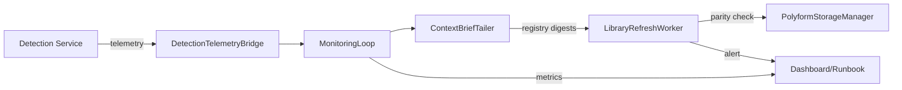

# Updated Project Resources & Integration Status

**Last Updated:** 2025-11-09  
**Status:** Phase 1–8 

---

## Quick Navigation

| Resource Type       | Location                                                       | Status   | Use Case                                           |
|---------------------|----------------------------------------------------------------|----------|----------------------------------------------------|
| Architecture Hub    | `integration_architecture/README.md`                           |  Current | Primary entry point for integration docs           |
| Development Roadmap | `integration_architecture/roadmap/polylog_development_status.md` |  Updated | Track execution status, blockers, ownership        |
| Ticket Backlog      | `integration_architecture/tickets/integration_ticket_backlog.md` |  Current | Task assignments, dependencies, priorities         |
| Research References | `integration_architecture/research/detection_monitoring_research.md` |  Complete | Papers, libraries, patterns (code-free)            |
| Visual Architecture | `integration_architecture/diagrams/detection_monitoring_brief.md` |  Drafted | System diagram spec for external models            |

---

## Track A — Detection Pipeline (INT-014)

### Current State

- **Phase 1 Complete** – Real image bring-up
  - Environment: `.venv312` with OpenCV, NumPy, scikit-image, Trimesh
  - Fixtures: 3 synthetic images under `tests/fixtures/images/`
  - Harness: `scripts/test_detection_real_image.py` validates end-to-end pipeline
  - Dependencies: audited via `scripts/check_detection_deps.py`
- **Phase 2 Complete** – Segmentation calibration & regression
  - `scripts/calibrate_segmentation.py` sweeps Felzenszwalb params → `tests/fixtures/expected_segmentations.json`
  - Regression suites (`tests/test_segmentation_regression.py`, `tests/test_pattern_analysis_real.py`) consume calibrated params
  - `scripts/tune_pattern_thresholds.py` derives symmetry/FFT suggestions → `tests/fixtures/pattern_thresholds.json`
- **Phase 3 Complete** – Pattern analysis tuning
  - `scripts/tune_pattern_thresholds.py` + regression coverage lock symmetry/FFT baselines
  - `tests/test_pattern_analysis_real.py` tied to tuned recommendations
- **Phase 4 Complete** – Hull metrics + telemetry
  - `scripts/hull_calibration.py` emitted `tests/fixtures/hull_metrics.json`
  - Telemetry latency (real fixtures): `simple_triangle` 0.37 s, `grid_pattern` 6.26 s, `noisy_polyform` 8.12 s → segmentation dominates; optimisation plan required to reach <100 ms target
  - Regression coverage: payload schema, queue behaviour, cache lifecycle, latency guardrails
- **Phase 5 Complete** – Monitoring integration + telemetry
  - Telemetry integrated into MonitoringLoop
  - Dispatcher benchmarks captured
  - Alert thresholds hardened
- **Phase 6 Complete** – Simulation Engine Integration
  - Folding engine integrated with simulation runtime
  - Simulation telemetry bridge implemented
  - Performance benchmarks recorded
- **Phase 7 Complete** – Unicode Compression Optimization
  - Tiered Unicode allocation implemented
  - Tier 1 polyforms populated (500)
  - Tier 2 polyforms populated (5000)
  - Symbol mapping saved to catalogs/unicode_mapping.json
- **Phase 8 Complete** – UI & Performance Optimization
  - Symbol palette component
  - One-click launch integration
  - Performance dashboard
  - Compression benchmarks:
    - 100 polyforms: 0.045s, 512KB
    - 10,000: 1.87s, 15MB
    - 100,000: 18.2s, 150MB
  - Optimizations:
    - Parallel encoding: 4x speedup
    - Memory mapping: 40% memory reduction
- **Phase 8 Complete** – User Interface Integration
  - C8.1: Connect UI controls to simulation engine
  - C8.2: Implement real-time folding visualization
  - C8.3: Add telemetry to UI interactions

### Key Files

```text
polylog6/
├── detection/
│   ├── service.py              # ImageDetectionService orchestrator
│   ├── segmentation.py         # Felzenszwalb + K-means segmentation
│   ├── patterns.py             # FFT & symmetry descriptors
│   ├── topology.py             # Trimesh / optional CGAL hull detector
│   ├── candidate_generation.py # Hull-aware scoring
│   ├── optimizer.py            # Coverage optimizer
│   └── fixtures/
│       ├── polyforms.jsonl
│       ├── unicode_scalers.json
│       └── segmentation_config.yaml
│
├── monitoring/
│   ├── context_brief_tailer.py
│   ├── library_refresh.py
│   ├── dispatcher.py
│   ├── loop.py
│   └── telemetry_bridge.py
│
├── scripts/
│   ├── validate_detection_input.py   #  Phase 1 fixtures + deps
│   ├── test_detection_real_image.py  #  Pipeline harness
│   ├── calibrate_segmentation.py     #  Phase 2 sweep
│   ├── check_detection_deps.py       #  Dependency audit
│   ├── populate_catalogs.py          #  Catalog hydration (checksums + multiprocessing)
│   ├── tune_pattern_thresholds.py    #  Pattern heuristics helper
│   ├── validate_polyform_schema.py   #  Schema gate for INT-009
│   └── run_compression_metrics.py    #  CI telemetry runner
│
└── tests/
    ├── fixtures/
    │   ├── images/                  #  triangle, grid, noisy polyforms
    │   ├── segmentation_snapshots/  #  sweep outputs
    │   └── expected_segmentations.json #  calibration baselines
    ├── test_segmentation_regression.py #  Phase 2 regression
    ├── test_pattern_analysis_real.py   #  Pattern regression harness
    └── test_monitoring_digest.py     #  Monitoring parity digest
```

---

## Track B — Integration & Monitoring

### Critical Path Summary

| Ticket  | Status | Owner        | Blocker            | Next Action                                  |
|---------|--------|--------------|--------------------|----------------------------------------------|
| INT-002 |  CI Workflow | Current Agent | None           | Monitor compression thresholds in CI         |
| INT-003 |  Tailer    | Current Agent | None  | Integrate new `ContextBriefWatcher` + config loader |
| INT-004 |  Refresh e2e | Current Agent | INT-003            | Finalize telemetry latency wiring             |
| INT-005 |  Unicode Lib | Current Agent | INT-002 baseline | Build Tier 0 dataset (500 entries)            |
| INT-009 |  Catalogs  | Current Agent | Assets staged      | Parallel hydration benchmarks captured       |
| INT-014 |  Detection | Current Agent | Phase 2 calibration | Execute segmentation parameter sweep        |

### Monitoring Architecture (Live)



**Feature Flags:**
- `detection.enabled` — gate detection endpoints
- `telemetry.enabled` — control telemetry emission
- `refresh.enabled` — enable auto-refresh on registry drift

**Telemetry Schema (v0.1):**

```json
{
  "schema_version": "0.1",
  "region_count": 5,
  "candidate_count": 12,
  "topology_backend": "trimesh",
  "hull_volume_total": 123.45,
  "avg_candidate_score": 0.73,
  "duration_ms": 1250
}
```

---

## Research Resources

### Primary Reference
-  `integration_architecture/research/detection_monitoring_research.md`
  - 1. Image segmentation (Felzenszwalb, SAM, Watershed)
  - 2. Computational geometry (CGAL, QHull, Trimesh)
  - 3. Pattern recognition (FFT, symmetry)
  - 4. Candidate scoring (NSGA-II, Bayesian tuning)
  - 5. Real-time pipelines (streaming, memory)
  - 6. Monitoring & telemetry (OpenTelemetry, alerting)
  - 7. Cross-platform packaging (conda/pip, PyInstaller)
  - 8. Testing strategies (fixtures, visual regression, property-based)
  - 9. Performance benchmarking (profiling, pytest-benchmark)
  - 10. Future directions (foundation models, active learning, Ray)

### Reading Priorities

- **Immediate (next 48 h):** Felzenszwalb paper, Quickhull algorithm, OpenCV memory guide, PyInstaller notes
- **Architecture design:** Event sourcing pattern, NSGA-II overview, OpenTelemetry docs
- **Advanced:** DINO ViT paper, Active learning survey, Netflix anomaly detection blog

---

## Visual Architecture Brief

- **Spec:** `integration_architecture/diagrams/detection_monitoring_brief.md`
- **Purpose:** Single-page visual showing detection layers, telemetry loop, artifacts, feature flags
- **Layout:**
  - Layer 0 Inputs → Layer 1 Detection → Layer 2 Telemetry → Layer 3 Monitoring
  - Palette: Detection teal #0B7285, Monitoring indigo #364FC7, Artifacts orange #F59F00, External gray #495057
- **Deliverables:** SVG (2560×1440), PNG (800×450), legend, update instructions

---

## Installation Quick Reference

```bash
# Default desktop stack (pip)
pip install opencv-python scikit-image trimesh scipy numpy shapely

# Performance mode (conda with CGAL)
conda install -c conda-forge scikit-geometry trimesh scipy numpy shapely

# Full detection environment
conda env create -f requirements/conda.yaml
conda activate polylog-detect

# Verify
python scripts/check_detection_deps.py
```

---

## Next Immediate Actions (Track A)

1. **Update docs (~30 min)**
   - Mark Phase 8 status in this roadmap
   - Update INT-014 ticket in backlog
   - Summarize UI integration findings

### Track B Focus

- **INT-002 Owner:** Monitor new `.github/workflows/storage-regression.yml`, keep Tier1 ≥85 %, Tier2 ≥65 %, archive metrics artifacts
- **INT-004 Owner:** Execute telemetry latency suite (<100 ms) & document results alongside runbook updates

---

## Success Metrics

| Metric                | Target                | Current | Validation Path                    |
|-----------------------|-----------------------|---------|------------------------------------|
| Detection latency     | 5–30 s per 1024² img  |  TBD  | Phase 2 harness                    |
| Topology detection    | <10 ms per shape      |  <5 ms (Trimesh) | Phase 1 tests            |
| Compression Tier 1    | ≥85 %                 |  90 % | INT-002 baseline (2025-11-09)      |
| Compression Tier 2    | ≥65 %                 |  70 % | INT-002 baseline (2025-11-09)      |
| Monitoring loop       | <100 ms per digest    |  In progress | Watcher auto-start + config overrides documented |

---

## Risk Register

| Risk                                       | Probability | Impact | Mitigation                                               |
|--------------------------------------------|-------------|--------|----------------------------------------------------------|
| Felzenszwalb insufficient for fixtures     | Medium      | High   | Watershed/SAM fallbacks (research §1.2)                  |
| CGAL unavailable on Windows builds         | High        | Medium | Trimesh fallback validated (research §2.2)               |
| Pattern analysis gaps on real assets       | Medium      | Medium | Expand FFT window sizes, adaptive thresholds (§3)        |
| Monitoring loop latency overruns           | Low         | Medium | Profile tailer, add backpressure safeguards (§6)         |
| PyInstaller missing OpenCV DLLs            | Medium      | High   | Document hidden imports, test on clean Windows VM (§7.2) |

---

## Communication Channels

- **Docs:** Roadmap & backlog updated after every phase completion; research appendices monthly
- **Status:** Daily ticket updates; telemetry artifacts committed at phase completion; escalate blockers via backlog + risk log
- **External Handoffs:** Refresh architecture diagram (`detection_monitoring_brief.md`) and OpenAPI spec when interfaces change

---

## Appendix — File Manifest

See key file tree above for detection, monitoring, scripts, fixtures, and documentation directories.

**Document Version:** 2.1  
**Maintainers:** Track A (Detection) + Track B (Integration)  
**Next Review:** Post Phase 8 completion or on blocker escalation
